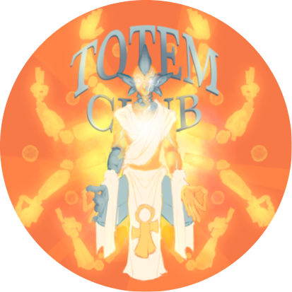

<h1 align="center">TSMP Launcher</h1>

Join the Totem SMP without worrying about installing Java, Forge, or other mods. We'll handle that for you.

## Downloads

You can download from [GitHub Releases](https://github.com/Redllamaaa/tsmplauncher/releases)

#### Latest Release

#### Latest Pre-Release

**Supported Platforms**

If you download from the [Releases](https://github.com/Redllamaaa/tsmplauncher/releases) tab, select the installer for your system.

| Platform | File |
| -------- | ---- |
| Windows x64 | `TSMP-Launcher-setup-VERSION.exe` |

More platforms to be added into the future if requred.

## HeliosLauncher

TSMPLauncher is a fork of [HeliosLauncher](https://github.com/dscalzi/HeliosLauncher).

