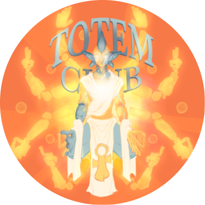

<h1 align="center">TSMP Launcher</h1>

Join the Totem SMP without worrying about installing Java, Forge, or other mods. We'll handle that for you.

## Wiki

You can view guides and get more information on our [Wiki](https://github.com/Redllamaaa/tsmplauncher/wiki)!

## Downloads

You can download from [GitHub Releases](https://github.com/Redllamaaa/tsmplauncher/releases)

#### Latest Release

**Supported Platforms**

If you download from the [Releases](https://github.com/Redllamaaa/tsmplauncher/releases) tab, select the installer for your system.

| Platform | File |
| -------- | ---- |
| Windows x64 | `TSMP-Launcher-setup-VERSION.exe` |
| macOS x64 | `TSMP-Launcher-setup-VERSION-x64.dmg` |
| macOS arm64 | `TSMP-Launcher-setup-VERSION-arm64.dmg` |
| Linux x64 | `TSMP-Launcher-setup-VERSION.AppImage` |

More platforms to be added into the future if requred.

## Installation Guide
Installation is fairly straightforward. If you need assistance, you can follow the brief instructions below.

> #### Windows
* Download and run the Windows version of the launcher (`.exe`).
* Windows SmartScreen will open.
* This is not a virus. To have it signed and have this not show up costs real money. I am not doing that. Deal with it.
  * 
  * Click **More info** and then **Run Anyway**.
* Follow the on-screen instructions to complete installation.

> #### MacOS
* Download and run the macOS version of the launcher (`.dmg`).
* Control-Click the app icon, then choose **Open** from the shortcut menu.
* Follow the on-screen instructions to complete the installation.

> #### Linux
* Download and run the Linux version of the launcher (`.AppImage`).
* Follow the on-screen instructions to complete the installation.

## Other Information
### HeliosLauncher

TSMPLauncher is a fork of [HeliosLauncher](https://github.com/dscalzi/HeliosLauncher).
Leah was here
